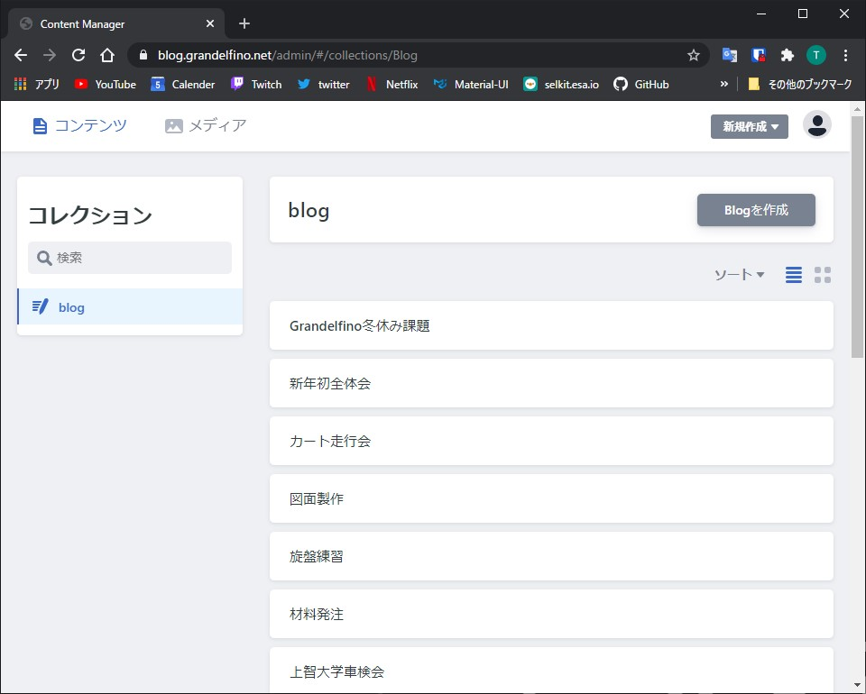
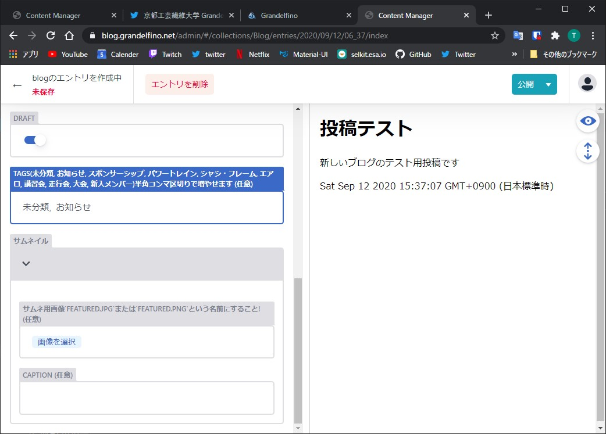

# ブログ記事の管理

## 管理ページへのログイン方法

ブログのURL末尾に`/admin`を加える  
[https://blog.grandelfino.net/admin](https://blog.grandelfino.net/admin)  

- **Netlify Identityでログインする** からログインを行ってください  
   [IDおよびパスワード](https://github.com/Grandelfino/secrets)

## 記事の新規作成

- 記事を作成する場合, 右上の **Blogを作成** から作成できます
  

## 記事の内容について

- ブログのタイトル, 本文, タグ, サムネイル用画像の順に記入します.  
また, サムネイル用に使う画像の名前は**必ずfeatured.jpgまたはfeatured.png**にしてください.

- サムネイルに用いた画像は自動的にブログ本文の一番上に表示されるので, 本文中に画像を追加する必要はありません.
- 下書き用に保存したい場合, `Draft`にチェックを入れると公開せずに保存されます
- タグはコンマ区切りで複数追加することができます.  
e.g.,(`お知らせ, スポンサーシップ`)

## 記事の公開,非公開,削除について

- 記事を破棄したい場合,左上の`未保存`で変更を破棄し,記事一覧に戻ることができます.
- 記事を一時的に保存したい場合, `Draftにチェックを入れ`右上の`公開`で下書きを保存できます.
- 記事が完成し投稿を行いたい場合は, `Draftのチェックを外し`, `公開`でブログに公開されます.
- 記事を削除する場合, 公開済みのエントリを選択し`エントリを削除`から完全に削除できます.

## 投稿した記事を編集したい場合

- エントリ一覧ページから,`ソート -> Publish this page on`で投稿の新しい順/古い順にソートすることができます.
- ソートには時間がかかる為,編集したい記事のタイトルを覚えている場合は左の検索からタイトルを記入したほうが早いです
- また,一番上の空欄のエントリとPostと書かれたエントリは**削除しないでください**
- 編集したいエントリを選択し,変更を完了したい場合は新規作成するときと同様に`公開`から更新ができます.
- 非表示にしたい場合も同様に`Draft`にチェックを入れ`公開`から非公開にすることができます