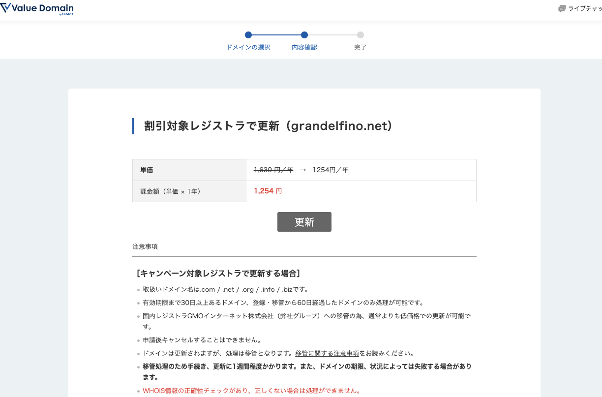

# ドメイン管理

チームでは [Valuedomain](https://www.value-domain.com/) というサイトから[grandelfino.net](grandelfino.net)というチームのドメインを購入しています．

大会後の10月頃にドメインの期限が来るので，その一ヶ月前を目処に更新をお願いします．

また，ログイン情報は[ここ](https://github.com/Grandelfino/secrets/blob/main/README.md#value-domain)にあります．

## 更新作業

[Valuedomain](https://www.value-domain.com/) のサイトにアクセスし，ログインしてください
- コントロールパネルと表示されたページから，ドメインの更新を選択してください

- 現在購入しているドメインが表示されるので，**grandelfino.net**を選択してください．
- ドメイン有効期限の30日以上前であれば，割引された料金で更新することができます．

- そうでない場合は通常料金の支払いが求められるので，**銀行振込**にて決済を行なってください．
  - 支払いに関しては，その時の会計担当の指示を仰ぐようにしてください．

## その他の設定項目
ドメインについては以下の設定を行なっています．

以下の内容は，特に変更する必要はありませんが，メモ程度に残しておきます．

### ネームサーバーの設定

ホームページおよびブログを稼働させているサービスであるNetlifyとこのドメインを紐づけるため，以下のネームサーバーへ変更しています．

- dns1.p07.nsone.net
- dns2.p07.nsone.net
- dns3.p07.nsone.net
- dns4.p07.nsone.net

基本的に変更する必要はありませんが，うまくサイトが表示されない場合や別のサーバーへと移管する場合は修正，変更してください．

### DNS設定
DNSには，ホームページとGoogleAnalyticsを連携させるために設定を行なっています．

### WHOIS情報

ドメインのWHOIS情報として，(おそらく)ドメインを取得した時に，OBである北山さんの名前と，チームの組織名，住所などが登録されています．