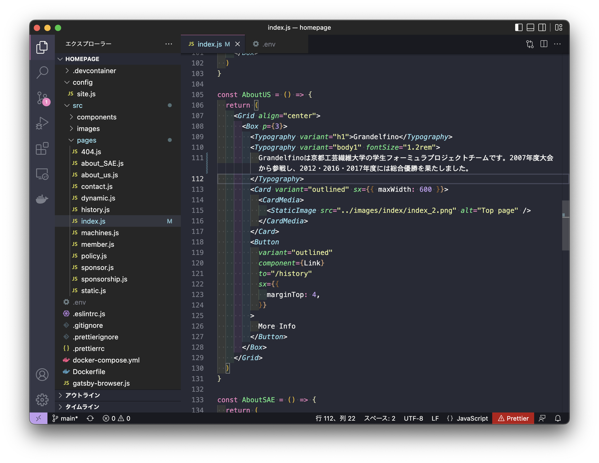

# grandelfino.net/

ホームページの最初の画面

画面に表示されるテキストは`<Typography>`で囲ってあります

```html
<Typograhpy>
    Some text
</Typograhpy>
```

例えば，2022年度優勝の文言を入れたい場合，


`src/pages/index.js`にある該当する文書を探して



```diff
<Typography variant="body1" fontSize="1.2rem">
-   Grandelfinoは京都工芸繊維大学の学生フォーミュラプロジェクトチームです。2007年度大会から参戦し、2012・2016・2017年度には総合優勝を果たしました。
+   Grandelfinoは京都工芸繊維大学の学生フォーミュラプロジェクトチームです。2007年度大会から参戦し、2012・2016・2017・2022年度には総合優勝を果たしました。
</Typography>
```


## 画像の差し替え

画像は

```html
<StaticImage src="../images/path/to/image.png" alt="image_name"/>
```

で指定する．画像フォルダは`src/images/*`に入れているので，imagesフォルダ内に適宜画像を入れて，その画像のパスを指定する．
パスの指定は `src="../images/画像があるファイルのパス"`で指定する．

例えば，マシンの画像を新しくしたい場合，新しい画像を`src/images/index/index_2.png`を置き換える

```html
...
<Typography variant="h1">Grandelfino</Typography>
<Typography variant="body1" fontSize="1.2rem">
    Grandelfinoは京都工芸繊維大学の学生フォーミュラプロジェクトチームです。2007年度大会から参戦し、2012・2016・2017・2022年度には総合優勝を果たしました。
</Typography>
<Card variant="outlined" sx={{ maxWidth: 600 }}>
    <CardMedia>
    // ../images/index/index_2.pngを置き換える．画像の名前が異なる場合は適宜それに合わせる
    <StaticImage src="../images/index/index_2.png" alt="Top page" />
    </CardMedia>
</Card>
...
```

