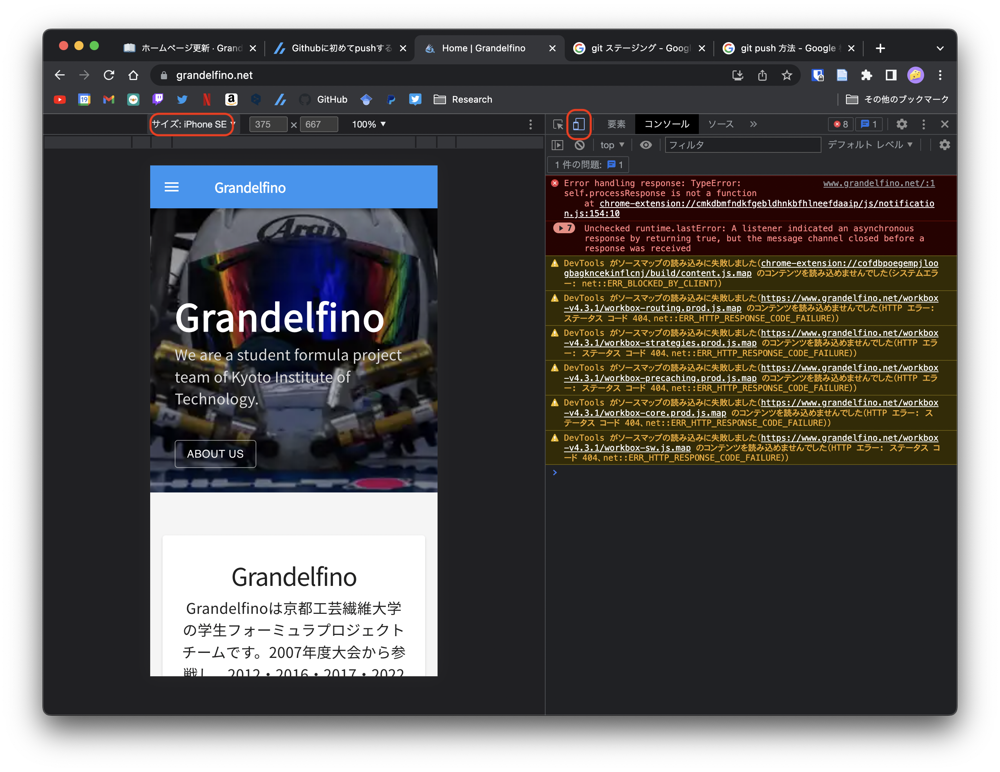

# ホームページ編集

Contentfulで編集できないところの修正を行うときのページ

先ずは，[環境構築](../env.md)からホームページをローカルで表示できるようにしてください

ページの編集を行う場合は，それと対応する`.js`ファイルを編集します．

ファイルの場所は`src/pages/*.js`にあります．

```shell
$ git clone https://github.com/Grandelfino/homepage && tree ./homepage -L 2
.
├── Dockerfile
├── README.md
├── config
│   └── site.js
├── docker-compose.yml
├── gatsby-browser.js
├── gatsby-config.js
├── jsconfig.json
├── netlify.toml
├── package-lock.json
├── package.json
└── src
    ├── components
    ├── images <- 画像を入れるフォルダ
    └── pages  <- 各ページを記述しているフォルダ
```

## ファイルとページの対応

- [トップページ - pages/index.js](home.md)
- チーム紹介 - pages/about_us.js
- 大会成績 - pages/history.js
- メンバー - pages/member.js
- お問い合わせ - pages/contact.js
- スポンサー一覧 - pages/sponsor.js
- スポンサーシップについて - pages/sponsorship.js
- FormulaSAEについて - pages/about_SAE.js
- 静的審査 - pages/static.js
- 動的審査 - pages/dynamic.js

## 変更を反映する

GitHubのmainブランチを更新すると自動的に反映されます．

mainブランチを更新するには，変更をステージングし，コミットを行い，それをGitHubにプッシュします．

```shell
git add . #変更をステージング
git commit -m "some messages"　#コミットの作成
git push #GitHubに送信
```

この辺の説明はGoogleで`git push 方法`などで調べるといくつか記事が出てくるので参考に

- [Githubに初めてpushするまでの話 - Zenn](https://zenn.dev/tknkaz/articles/04bbcb04a9b007)

変更を反映する時は必ずGoogle Chormeなどのブラウザで表示をチェックすること．
また，F12で開発者ツールを用いてスマートフォン用の表示に切り替えると小さい画面の表示も確認できる

