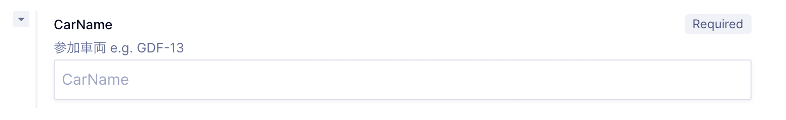
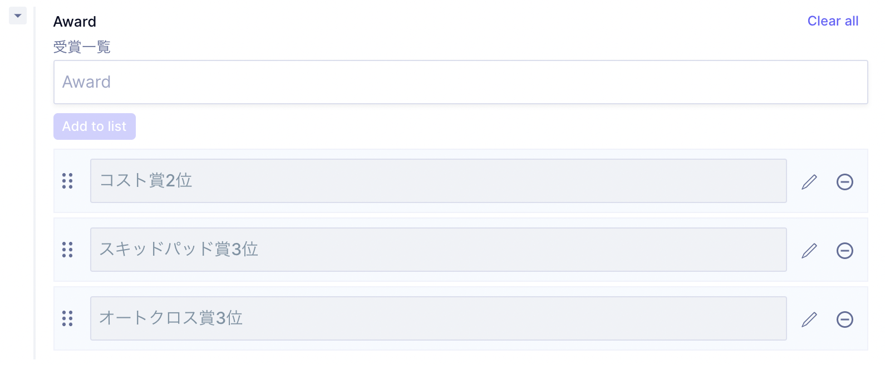

# 大会成績

**History**から車両の一覧が表示されます
項目が多いので，重要な箇所のみ説明します
- CarName
  - Machineの**CarNameと必ず一致**させてください

- それぞれの得点の入力順は,  
  - 得点数
  - その種目の満点
  - チームの順位  
になっています, 一つずつ順番に追加してください.

- また順位がない場合(リタイア等)は,得点と満点のみ入力してください.
- 動的審査の****Statusは 
  - 完走:Finish
  - リタイア:Retier
  - 出走せず:DNS(Do not startの略)から一つ選んでください
- Awardは受賞したものを以下のように列挙してください
