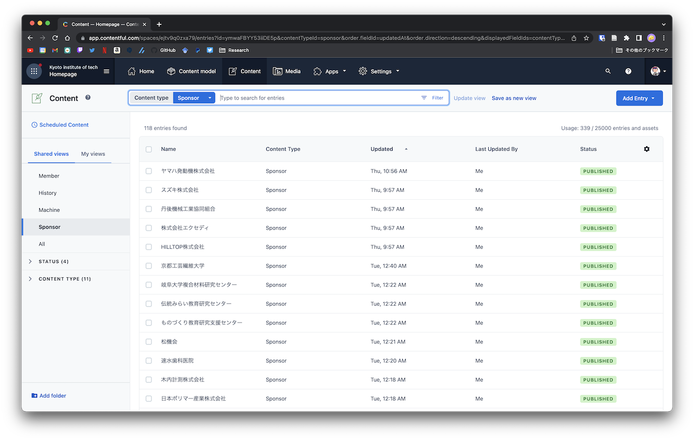
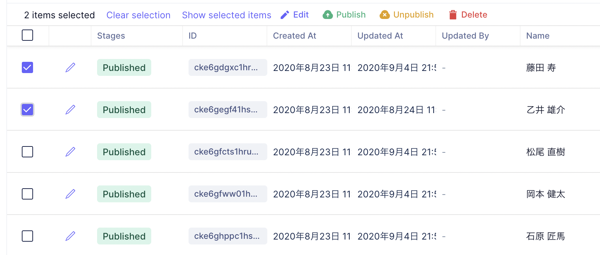
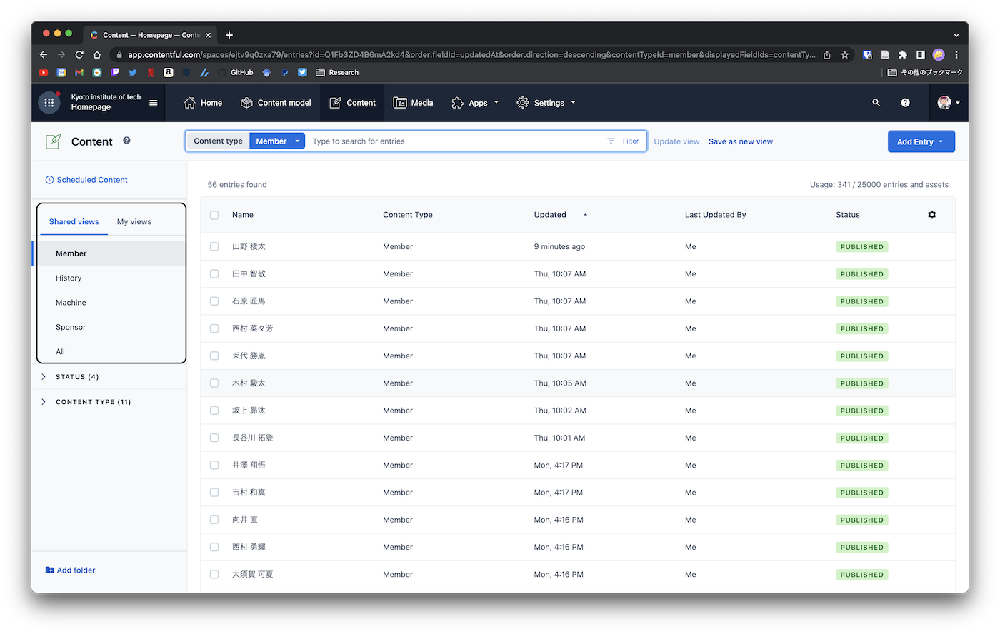

# ホームページ管理

~~サークルのホームページはNetlifyとGraphCMSというサービスを利用しています．~~  
> 2022/9/24: NetlifyとContentfulに切り替えました

本ページでは，主にコンテンツを管理しているContentfulについて解説します．

## ログイン方法

[contentful.com](https://www.contentful.com/)にアクセスし，右上のLoginからログインできます．

ログインに必要なIDとパスワードは[ここ](https://github.com/Grandelfino/secrets)にあります．

## 新規作成

左側の上から3番目のアイコンである**Content**から追加，削除等を行うことができます．

新しくデータを追加する時は，右上の`Add Entry`から追加できます．

## 削除，編集

コンテンツ一覧から削除したい，または非表示にしたいものにチェックボックスを入れ，

- 非表示にしたい場合は**Unpublish**

- 公開していないもの，または再度表示させたい場合は**Publish**

を選択することで表示の管理を行うことができます．

## 表示カテゴリの選択

左のタブから表示するカテゴリを選べます

- Member
- History
- Machine
- Sponsors
- All

