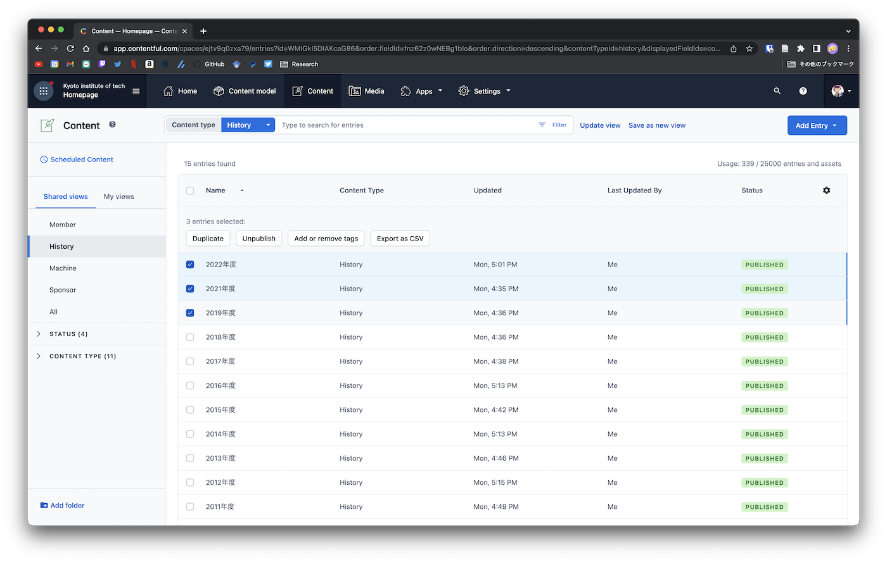

# ホームページ管理

サークルのホームページはNetlifyとGraphCMSというサービスを利用しています．

本ページでは，主にコンテンツを管理しているGraphCMSについて解説します．

## ログイン方法

[graphcms.com](https://graphcms.com/)にアクセスし，右上のLoginからログインできます．

ログインに必要なIDとパスワードは[ここ](https://github.com/Grandelfino/secrets)にあります．

## 新規作成

左側の上から3番目のアイコンである**Content**から追加，削除等を行うことができます．

## 削除，編集

コンテンツ一覧から削除したい，または非表示にしたいものにチェックボックスを入れ，
- 削除したい場合には**Delete**

- 非表示にしたい場合は**Unpublish**

- 公開していないもの，または再度表示させたい場合は**Publish**

を選択することで表示の管理を行うことができます．

また，編集を行いたい場合は左側のペンのアイコンをクリックすることで編集画面を表示することができます

