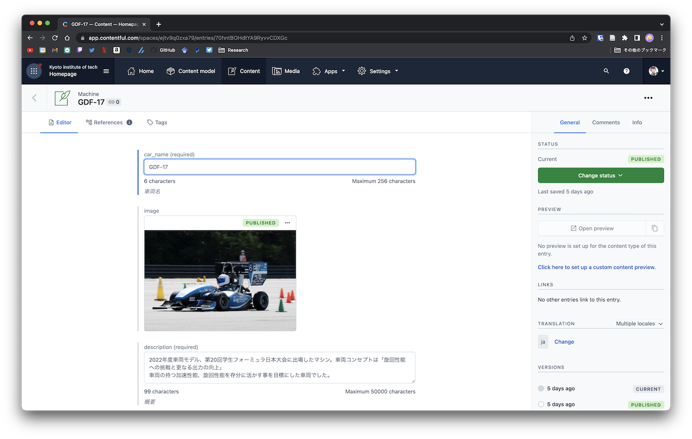

# 歴代車両

**Machine**から車両の一覧が表示されます

- CarName
  - 車両名を記述します．
  - この名前は後の大会成績で利用します．
  - GDF-xx(xxは番号)にする
- Image
  - 車両の写真を選択します
  - Add Mediaから選択およびアップロードを行うことができます．
  - また，車両の写真が存在しない場合は空欄でも構いません
- Description
  - 車両についての説明を記述します．
- Competition
  - その車両で出場した大会のデータを選んでください
  - また，大会に出場していない場合は空欄でも構いません

## 写真の追加

写真をアップロードする時は，写真を選択した後，右の`Publish`を押さないとファイルがアップロードされません

