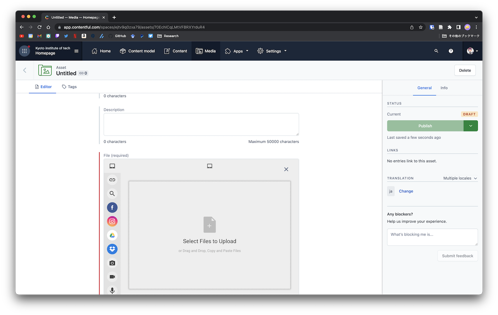

# 歴代車両

**Machine**から車両の一覧が表示されます

- CarName
  - 車両名を記述します．
  - この名前は後の大会成績で利用します．
  - GDF-xx(xxは番号)にする
- Image
  - 車両の写真を選択します
  - Add existing Imageから選択およびアップロードを行うことができます．
- Description
  - 車両についての説明を記述します．

## 写真の追加

すでにアップロードされている場合，リストの左のアイコンから画像を選択できます．

まだアップロードされていない場合，右下のUploadから追加可能です．

