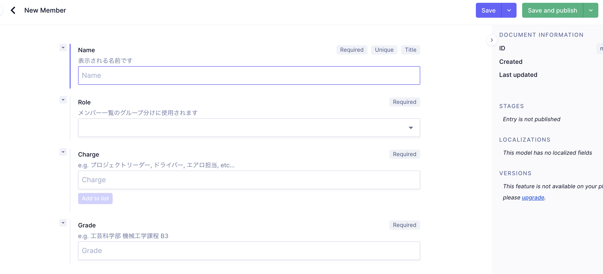

# メンバー管理

メンバーの新規作成や編集について

## 新規作成

**Member**から，Create Itemで新たに作成することができます．

- Name
  - 表示される名前です．フルネームで記述してください
- Role メンバーのページの割り振りに使います
  - Admin:幹部
  - Chassis:シャシ，フレーム班
  - FA: 指導教員
  - Powertrain: パワートレイン班
- Charge
  - 担当パーツなどを記述します．
- Grade
  - 学部，課程などを記述します．

以下は作成例です．
他のコンテンツも同様にして作成，編集が可能です．

## 編集

変更後は，左上の**Publish changes**から更新を適応することができます．
